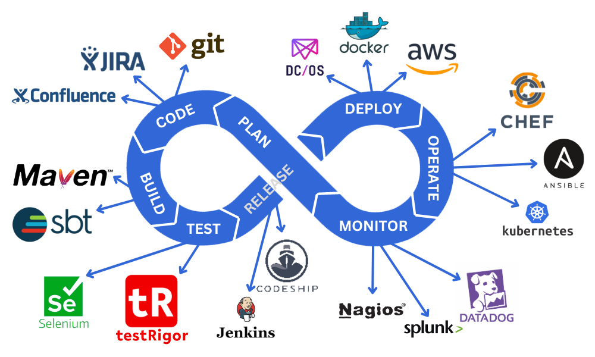

# CICD pipelines vs DevOPS

CICD stands for **Continous Integration and Continous Development** . 

DevOps , abriviation is Development and Operations . This comprises of the tools used in **communicating , integrating and collaborating** in the development cycle of software  .

