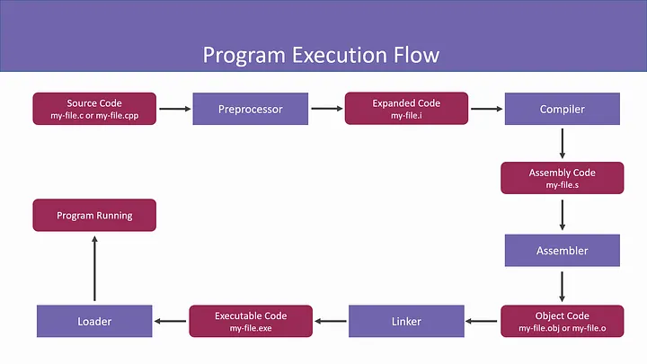

# C++ Interview Prep

## C++17
- `if constexpr`: Compile-time branching
- `std::optional`: Safe handling of missing values
- Structured Bindings: Cleaner tuple/pair unpacking
- Parallel Algorithms: Execution policies for speed-up

## C++20
- Concepts: Constrained templates
- Ranges: Functional-style pipelines
- Coroutines: Async & generators
- Modules: Faster builds, no headers

## How a C++ code runs 

- Preprocessor
  
  Preprocessor converts Source code to Expanded code.

- Compiler

   Compiler converts the Expanded code to Assembly code.

- Assembler

  Assembler converts the Assembly code to Object code.

- Linker

  Linker converts the Object code to Executable code.

- Loader

  Finally, the Loader loads the executable file into memory.

