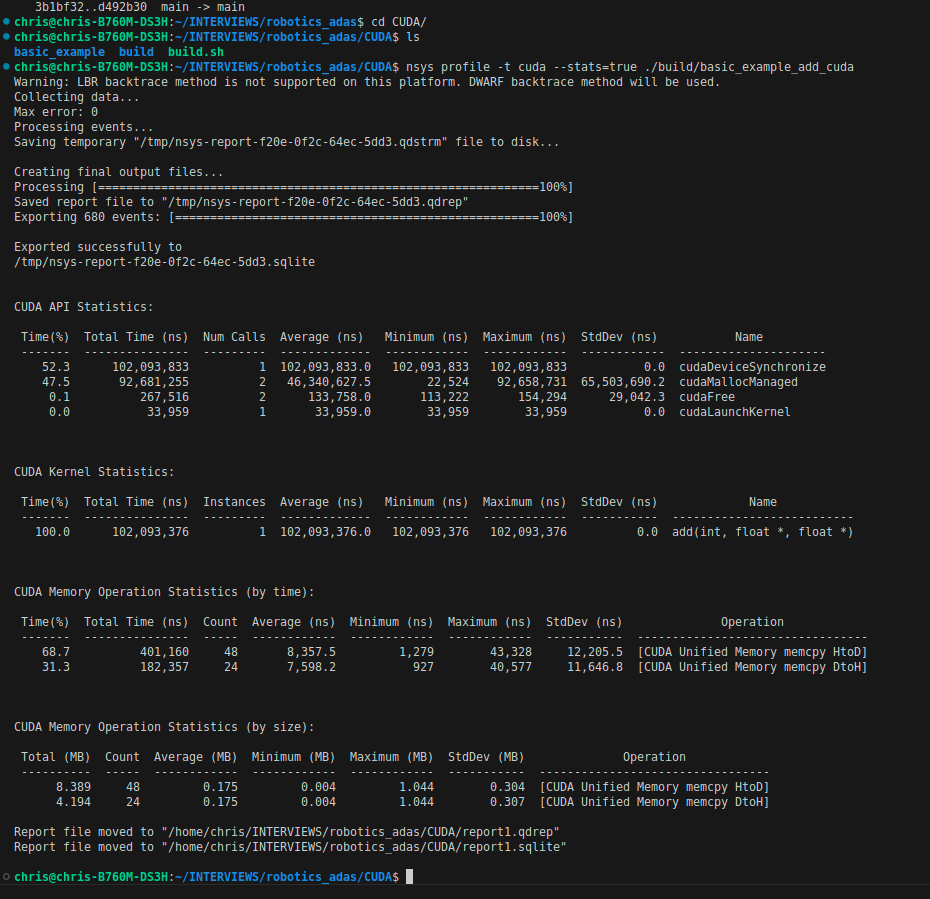

# This is a basic CUDA walk through 


- basic_example , of add two numbers
   
   - CPU based example compiled with G++
   - GPU based example compiled with nvcc
        - turn our add function into a function that the GPU can run, called a kernel in CUDA. To do this, all I have to do is add the specifier __global__
        - __global__ function is known as a CUDA kernel, and runs on the GPU. Code that runs on the GPU is often called device code, while code that runs on the CPU is host code .
        - To allocate data in unified memory, call cudaMallocManaged(), which returns a pointer that you can access from host (CPU) code or device (GPU) code. To free the data, just pass the pointer to cudaFree().


## Profile the CUDA code

NSight Systems CLI, `nsys`

```
nsys profile -t cuda --stats=true ./build/basic_example_add_cuda 
```




## Threads

CUDA’s <<<1, 1>>> syntax

CUDA GPUs run kernels using blocks of threads that are a multiple of 32 in size; 256 threads is a reasonable size to choose.

```
add<<<1, 256>>>(N, x, y);
```

# References

- https://developer.nvidia.com/blog/even-easier-introduction-cuda/